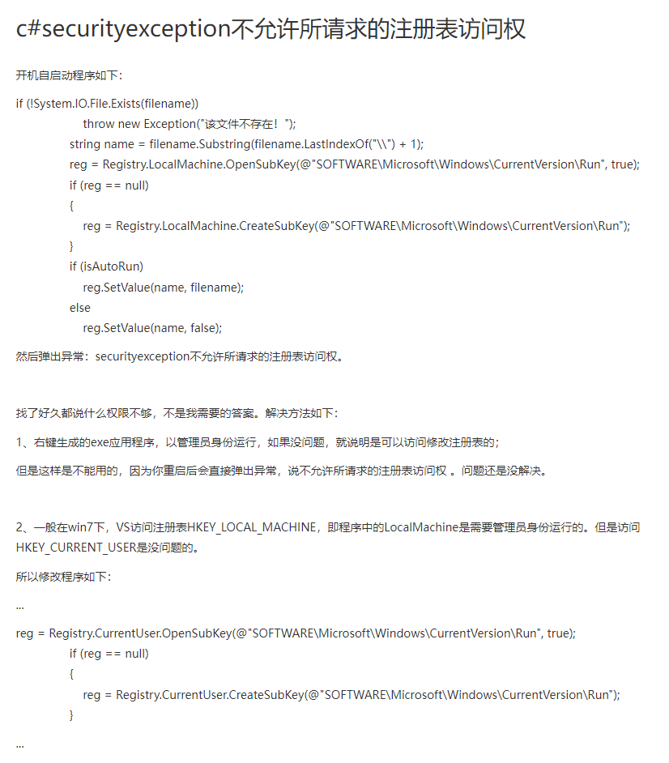

# 1、一些基础笔记

### 1、三种取整方式
```c#
Math.Round()：四舍六入五取偶
Math.Floor()：向下取整
Math.Ceiling()：向上取整

注意：返回值都是double型，而不是整型
```

### 2、获取二维数组的行数和列数
```c# 
int row = arr.Getlength(0);
int col = arr.getlength(1);
```

### 3、二维list
```c#
//二维list就是把2个一维list插入初始化好的二维list利
//初始化二维list
list<listM<string>> arrayAB = new list<list<string>>();
//初始化一个一维list
list<string> arrayA = new list<string>();
arrayA.Add("一")；
arrayA.Add("二")；

//初始化第二个一维list
list<string> arrayB = new list<string>();
arrayB.Add("一")；
arrayB.Add("二")；

//把两个一维list放入到二维list里
arrayAB.Add(arrayA);
arrayAB.Add(arrayB);
```

### 4从窗体进入到CAD界面需要锁定文档
  + eLockViolation 错误表示需要锁定文档


### 5、C#请求注册表失败

