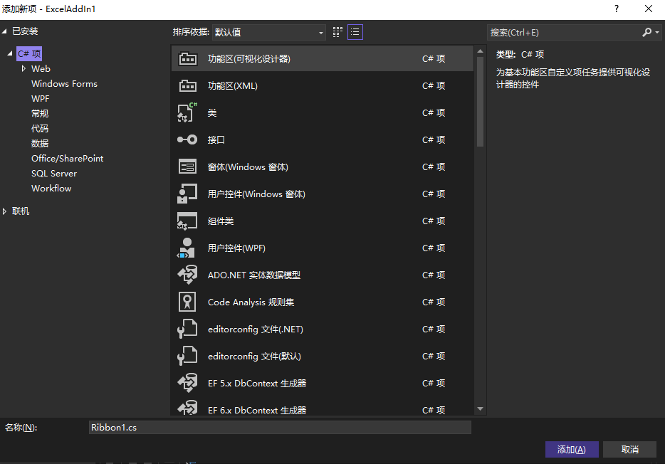

# 使用Visual Studio进行Excel VSTO扩展程序开发
[说明与基本操作](https://blog.csdn.net/colingg/article/details/84797444)

### 1、实际应用
 1. Excel应该是我们在日常工作中非常常用的一个效率工具，那么如果想要扩展Excel更多的业务功能，可以在VS开发环境中为Excel开发VSTO扩展程序，这样就可以借助微软为我们开放的操作Excel的接口，在Office的功能区添加选项卡、控件后完成一些我们所需的任何业务功能：
  
 


 ## 2、新建Excel VSTO外接程序
 
1. 在VS中新建一个Excel扩展应用程序，如果没有找到这个选项，去红框里的VS安装程序中勾选Office开发选项即可（VS版本是2022）
   
   

  
  
  
  
  
  
2. ThisAddIn. cs就是VSTO扩展程序的主入口，它提供了很多回调事件给我们使用


3. 在新建项目的解决方案中点击右键为Excel工程创建功能区，这个功能区就是Excel VSTO外界程序的用户界面




4.两个常用库
+ **using Microsoft.Office.Interop.Excel;**

+ **using Microsoft.Office.Tools.Excel;**

>Interop.Excel名称空间
一个微软提供给我们的访问Excel的COM接口，它最大的用处就是：利用它可以直接对Windows版本的Excel中的内容进行读写，例如：
获取Excel中的所有工作表
获取\修改Excel中的单元格
新增一个worksheet页
等等
Tools.Excel名称空间
是一个用于扩展支持Office Excel对象模型的类库，利用它可以将.NET的其他组件与Excel配合在一起实现一些功能，例如：
利用ListObject接口可以将DataTable实例与Excel的worksheet表进行关联的操作
利用Chart接口可以为Excel的sheet添加一个图表


## 3、Excel开发中的抽象类型
1、Application

在VSTO程序中，Application接口代表了整个Excel应用程序

2、WorkSheet

WorkSheet对象是WorkSheets对象集的成员，是Excel中的sheet页的抽象

3、Range

Range对象就是对Excel中每一个单元格的抽象，或者是包含一个或多个单元格块的选定区域（这个区域可以是连续的也可以是不连续的）

以上这三个元素就是Excel在VSTO变成当中，最常用到的三个抽象接口


## 4、基本操作
+ 在Excel工程中，在ThisAddIn文件中和项目的其他文件中，读写Excel元素的方式是不同的：

+ 在ThisAddIn. cs文件中，访问Excel中的元素，直接用Application访问即可：
```c#
using Excel = Microsoft.Office.Interop.Excel;

Excel.Worksheet activeWorksheet = ((Excel.Worksheet)Application.ActiveSheet);
Excel.Range firstRow = activeWorksheet.get_Range("A1");

```

+ 但是在非ThisAddIn .cs文件当中，比如新建功能区的按钮事件，若想访问Excel元素，则必须在前边加上Globals.ThisAddIn才能够正常访问
  
+ 由于在一般情况下，是根本不会在主程序中去做业务操作的，所以以后所有基本操作的例子，我都会按照非主程序的访问方式给出：

```c#
using Microsoft.Office.Tools.Ribbon;
using Microsoft.Office.Interop.Excel;
using ExcelTools = Microsoft.Office.Tools;

// worksheet级别的操作：
Worksheet wst = ((Worksheet)Globals.ThisAddIn.Application.ActiveSheet);                     // 获取当前选中的Sheet页;
Worksheet wst2 = ((Worksheet)Globals.ThisAddIn.Application.Worksheets["考核情况"]);         // 根据名称获取Sheet页;

// 新建worksheet
Worksheet new_wst;
new_wst = (Worksheet)Globals.ThisAddIn.Application.Worksheets.Add();
new_wst.Name = "新建Sheet页";

int rowsCount = wst.UsedRange.Rows.Count;                                                   //获取已经使用的行
int colsCount = wst.UsedRange.Columns.Count;                                                //获取已经使用的列

var content = wst2.Range["A1"].Value;                                                       // 获取表中单元格内容
((Range)wst.Range["A8"]).Value = "111";                                                     // 写入单元格数据

((Range)wst2.Rows[2, Type.Missing]).Delete(XlDeleteShiftDirection.xlShiftToLeft);           // 删除某一行
((Range)wst2.Cells[1, 2]).EntireColumn.Delete(0);                                           // 删除某一列

// 取出这个表所有的列
// 如果不用UsedRange的话，就会获取到Excel包含空白的所有列
List<string> all_column = new List<string>();
foreach (Range all_col in wst2.UsedRange.Columns)
{
    all_column.Add(all_col.Value2[1, 1]);
}

// 获取当前Excel表的所有表名;
List<string> m_AllSheets = new List<string>();
foreach (var sheetlist in Globals.ThisAddIn.Application.Worksheets)
{
    m_AllSheets.Add(((Worksheet)sheetlist).Name);
}

```

## 5、Excel的扩展控件
微软为Excel提供了几个比较有用的扩展控件，能够帮助Excel完成更多的扩展功能，例如：

+ 为worksheet添加表格并绑定数据源
  
+ 为worksheet添加图表并绑定数据源。如下图所示：