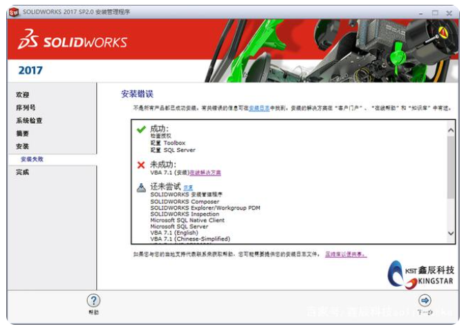

## solidwork软件安装显示失败问题处理
### 1、实际问题：

卸载了Solidworks2010，第二次安装会出现安装不上情况，如下图所示：

### 2、原因分析
+ 就此单独针对显示VBA7.1失败问题的情况，可执行以下文章操作步骤进行解决该问题
  
 **Q：什么情况下会出现该问题?**

	>在安装 SOLIDWORKS 2021 SP2 软件之后更新、修改或安装旧版本的 SOLIDWORKS 时会出现此错误。

	**Q：具体的原因是什么呢?**

	>SOLIDWORKS2021 SP2 软件中引入的Visual Basic for Applications (VBA) 版本 7.1 发生了更改。较早版本的 SOLIDWORKS 安装管理程序安装程序不能识别新的 VBA 7.1 组件。因此，安装程序会启动更早版本程序的新安装。新的 VBA 7.1 安装随后会阻止软件安装。
	
### 3、解决办法

 1、 卸载新版本的 VBA 7.1

  2、 执行导致错误的安装步骤。现在安装应成功。

  3、 执行最近 SOLIDWORKS 安装(SOLIDWORKS 2021 SP2 或更高版本)的修复，以重新安装已更新的 VBA 7.1 组件。
  
  + 首先卸载进入控制面板卸载程序中卸载所有带visual studio tools for applications前缀的文件，如果有VBA7.1的话也要卸载(找不到在右上角搜索处搜索没有的话请忽略)
    
    
   

  
  + + 然后执行clean up.exe程序(两个运行程序均在下面链接)，再把S-078838_uninstall_vba.bat文件放到C盘根目录，右键以管理员运行打开即可。这时就可以重新安装solidworks了#SolidWorks#

+ 链接：https://pan.baidu.com/s/19tPrih_uUa5bF9qJZOwFRQ

+ 提取码：star